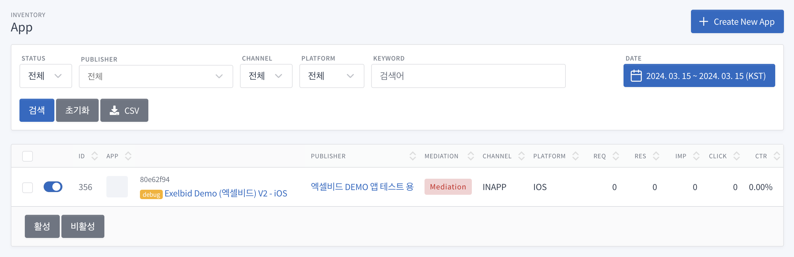
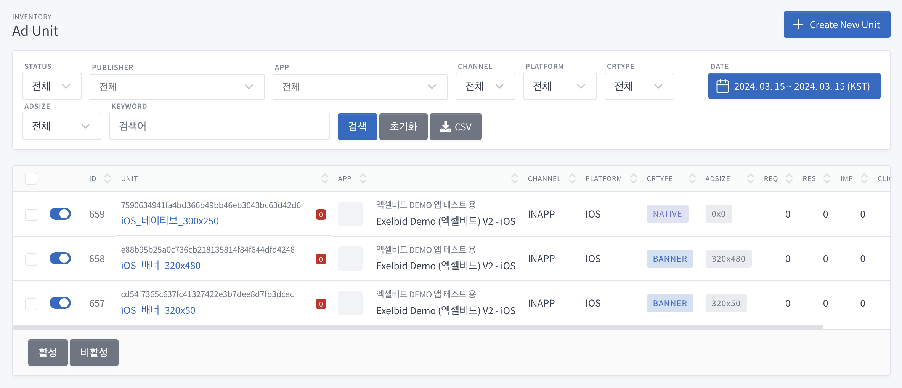

# Exelbid SDK for ObjectiveC

ObjectiveC 가이드입니다.  
Swift 가이드는 [README](./README.md)를 참고해주세요.

목차
=================

- [Version History](#version-history)
- [SDK 정보](#sdk-정보)
- [시작하기](#시작하기)
  - [ExelBid SDK 추가하기](#SDK-추가하기-for-cocoapods)
  - [어플리케이션 설정](#어플리케이션-설정)
- [광고 적용하기](#광고-적용하기)
  - [광고 요청 인스턴스 공통 메소드](#광고-요청-인스턴스-공통-메소드)
  - [배너 광고](#배너-광고)
  - [전면 광고](#전면-광고)
  - [네이티브 광고, 네이티브 동영상 광고](#네이티브-광고-네이티브-동영상-광고)
  - [네이티브 TableView Adapter](#네이티브-tableview-adapter)
  - [네이티브 CollectionView Adapter](#네이티브-collectionview-adapter)
- [미디에이션](#미디에이션)
- [MPartners](#mpartners)
  - [배너 광고](#mpartners-배너-광고)
  - [네이티브 광고](#mpartners-네이티브-광고)


# Version History

##  Version 2.1.1
- MPartners Banner, Native 추가

[Old Version History](./VersionHistory.md)


# 시작하기 전에

- Exelbid에서는 광고 요청에 대한 응답 후 노출까지의 시간(노출 캐시 시간)을 30분 이내로 권장합니다.(IAB 권장)
- 광고 응답 이후 노출 시간 차이가 해당 시간보다 길어지면 광고 캠페인에 따라서 노출이 무효 처리될 수 있습니다.


# SDK 정보
ExelbidSDK는 Xcode 15.3, iOS 12.0 버전으로 빌드되었습니다.  
XCFramework 형태로 제공됩니다.  

- 참조 1: [App Store 제출을 위한 SDK 최소 요구 사항 보기](https://developer.apple.com/kr/news/upcoming-requirements)
- 참조 2: [최소 요구 사항 및 지원되는 SDK](https://developer.apple.com/kr/support/xcode)


# 시작하기

## SDK 추가하기 for CocoaPods

**[Cocoapods 설치 가이드](https://guides.cocoapods.org/using/getting-started.html)**

### POD Install

Podfile 만들기
```
pod init
```

Podfile 수정
```
vi Podfile
```
```
target 'MyApp' do
  use_frameworks!
  
  pod 'ExelBid_iOS_Swift'
end
```

Podfile 설치
```
pod install
```

## 어플리케이션 설정

### 광고식별자 권한 요청

사용자로부터 개인정보 보호에 관한 권한을 요청해야 합니다.  
앱 설치 후 한번만 요청되며, 사용자가 권한에 대해 응답 후 더 이상 사용자에게 권한 요청을 하지 않습니다.  
광고식별자를 수집하지 못하는 경우 광고 요청에 대해 응답이 실패할 수 있습니다.

**※ 광고를 호출하기 전에 완료되어야 합니다.**
```
#import <AppTrackingTransparency/AppTrackingTransparency.h>

...

if (@available(iOS 14, *)) {
    [ATTrackingManager requestTrackingAuthorizationWithCompletionHandler:^(ATTrackingManagerAuthorizationStatus status) {
        
    }];
}
```

> 앱이 실행될때 광고식별자 권한 요청을 권장합니다.
>
> **AppDelegate.m**
> ```
> - (void)applicationDidBecomeActive:(UIApplication *)application
> {
>     if (@available(iOS 14, *)) {
>         [ATTrackingManager requestTrackingAuthorizationWithCompletionHandler:^(ATTrackingManagerAuthorizationStatus status) {
>  
>         }];
>     }
> }
> ```

### Info.plist 설정

| Key                                                          | Required | Value                                    | Description                 |
|--------------------------------------------------------------|----------|------------------------------------------|-----------------------------|
| Privacy - Tracking Usage Description                         | 필수       | EX) 맞춤형 광고 제공을 위해 디바이스 식별 데이터를 사용하려 합니다. | 앱이 디바이스 추적 데이터에 액세스 해야하는 이유 |
| App Transport Security Settings<br/> > Allow Arbitrary Loads | 선택       | EX) YES or NO                            | HTTP 프로토콜 임의 로드 여부 설정       |


# 광고 적용하기

1. 계정을 생성합니다
2. Inventory -> App -> Create New App
   

3. Inventory -> Unit -> Create New Unit
   

## 광고 요청 인스턴스 공통 메소드

> 광고의 효율을 높이기 위해 나이, 성별을 설정하는 것이 좋습니다.

- setAdUnitId(String) : 광고 아이디를 셋팅 합니다.
- setCoppa(NSString) : 미국 아동 온라인 프라이버시 보호법(COPPA) (0 : 미적용, 1 : 적용)
- setYob(NSString) : 태어난 연도 4자리(2016)
- setGender(NSString) : 성별 (M : 남자, F : 여자)
- setLocation(CLLocation) : 위치 정보
- setKeywords(NSString) : Custom 메타 데이터 (Key=Value, ...)
- setTesting(BOOL) : 광고의 테스트를 위해 설정하는 값입니다. 통계에 적용 되지 않으며 항상 광고가 노출되게 됩니다.


## 위치 정보 안내
SDK에서는 위치 추적을 직접적으로 하지 않습니다.  
위치정보는 선택 사항이며 앱을 통해 CLLocation을 전달받습니다.


## 배너 광고

**1. 광고 요청을 위한 변수 선언**

```
// 광고 인스턴스  
@property (nonatomic, strong) EBAdView *adView;

// 광고가 표시될 뷰
@property (weak, nonatomic) IBOutlet UIView *adViewContainer;
```

**2. 광고 인스턴스 생성**
```
/**
 * @param adUnitId - 광고 유닛 ID
 * @param size - 원하는 광고 크기입니다.
 */
- (nonnull instancetype)initWithAdUnitId:(NSString *)adUnitId size:(CGSize)size
```

예시)
```
// 광고 인스턴스 생성
self.adView = [[EBAdView alloc] initWithAdUnitId:@"adUnitId" size:self.adViewContainer.bounds.size];
self.adView.delegate = self;

// 광고의 효율을 높이기 위해 나이, 성별을 설정하는 것이 좋습니다.
[self.adView setYob:@"1976"];
[self.adView setGender:@"M"];

// AdView 안에 너비 100%로 웹뷰가 바인딩되게 설정하려면 아래와 같이 메소드를 추가할 수 있습니다.  
// 기본 상태는 설정된 광고사이즈로 센터정렬되어 바인딩 된다.
[self.adView setFullWebView:YES];

// 광고 테스트 여부 (통계에 집계되지 않음)
[self.adView setTesting:YES];
```

**3. 광고 위치에 광고 뷰 추가**
```
[self.adViewContainer addSubview:self.adView];

// 광고 뷰에 AutoLayout constraint 적용
[self setAdViewAutolayoutConstraint:self.adViewContainer mine:self.adView];
```

**4. 광고 요청**
```
[self.adView loadAd];
```


### 배너광고 Protocol (EBAdViewDelegate Protocol Reference)
```
// 광고를 성공적으로로드하면 전송됩니다.
- (void)adViewDidLoadAd:(EBAdView *)view;

// 광고로드에 실패 할 때 전송됩니다.
- (void)adViewDidFailToLoadAd:(EBAdView *)view;

// 콘텐츠를로드하려고 할 때 전송됩니다.
- (void)willLoadViewForAd:(EBAdView *)view;

// 모달 콘텐츠를 닫았을 때 전송되어 애플리케이션에 제어권을 반환합니다.
- (void)didLoadViewForAd:(EBAdView *)view;

// 사용자가 광고를 탭하여 애플리케이션에서 나가려고 할 때 전송됩니다.
- (void)willLeaveApplicationFromAd:(EBAdView *)view;
```


## 전면 광고

**1. 전면 광고 요청을 위한 변수 선언**
```
// 전면 광고 인스턴스  
@property (nonatomic, strong) EBInterstitialAdController *interstitial;
```

**2. 전면 광고 인스턴스 생성 함수 호출**

### Deprecated
- (EBInterstitialAdController *)interstitialAdControllerForAdUnitId:(NSString *)adUnitId : 이 함수는 더 이상 사용되지 않습니다. 대신 `(instancetype)initWithAdUnitId:(NSString *)adUnitId`를 사용하세요.

```
@interface EBInterstitialAdController : UIViewController

/**
 * @param adUnitId - 광고 유닛 ID
 */
- (instancetype)initWithAdUnitId:(NSString *)adUnitId
```

예시)
```
// 전면 광고 인스턴스 생성
self.interstitial = [[EBInterstitialAdController alloc] initWithAdUnitId:@"adUnitId"];
self.interstitial.delegate = self;
```

**3. 전면 광고 요청**
```
[self.interstitial loadAd];
```

**4. 전면 광고 표시**
```
/**
 * @param controller 전면 광고를 표시하는 데 사용해야하는 UIViewController입니다.
 */
- (void)showFromViewController:(UIViewController *)controller;
```

예시)
```
[self.interstitial showFromViewController:self];
```

### 전면 광고 Protocol (EBInterstitialAdViewDelegate Protocol Reference)
```
// 전면 광고를 성공적으로로드하면 전송됩니다.
- (void)interstitialDidLoadAd:(EBInterstitialAdController *)interstitial;

// 광고를로드하지 못할 때 전송됩니다..
- (void)interstitialDidFailToLoadAd:(EBInterstitialAdController *)interstitial;

// 전면 광고가 화면에 표시되기 직전에 전송됩니다.
- (void)interstitialWillAppear:(EBInterstitialAdController *)interstitial;

// 전면 광고가 화면에 표시된 후에 전송됩니다.
- (void)interstitialDidAppear:(EBInterstitialAdController *)interstitial;

// 전면 광고가 화면에 표시되지 못할때
- (void)interstitialDidFailToShow:(EBInterstitialAdController *)interstitial;

// 전면 광고가  화면에서 닫히기 직전에 전송됩니다.
- (void)interstitialWillDisappear:(EBInterstitialAdController *)interstitial;

// 전면 광고가 화면에서 해제 된 후 전송되어 애플리케이션에 제어권이 반환됩니다.
- (void)interstitialDidDisappear:(EBInterstitialAdController *)interstitial;

// 로드 된 전면 광고를 더 이상 표시 할 수 없을 때 전송됩니다.
- (void)interstitialDidExpire:(EBInterstitialAdController *)interstitial;

// 사용자가 전면 광고를 탭하고 광고가 타겟 작업을 수행하려고 할 때 전송됩니다.
- (void)interstitialDidReceiveTapEvent:(EBInterstitialAdController *)interstitial;
```

## 전면 동영상 광고

**1. 전면 동영상 광고 요청을 위한 변수 선언**

```
// 전면 동영상 광고 인스턴스  
@property (nonatomic, strong) EBVideoManager *adManager;

```

**2. 전면 동영상 광고 호출**

### Deprecated
- (EBVideoManager *)initFullVideoWithIdentifier:(NSString *)adUnitId : 이 함수는 더 이상 사용되지 않습니다. 대신 `(instancetype)initWithIdentifier:(NSString *)adUnitId`를 사용하세요.

예시)
```
// 전면 동영상 광고 유닛 설정
self.adManager = [[EBVideoManager alloc] initWithIdentifier:@"adUnitId"];

// 광고의 효율을 높이기 위해 나이, 성별을 설정하는 것이 좋습니다.
[self.adManager yob:@"1976"];
[self.adManager gender:@"M"];

// 광고 테스트 여부 (통계에 집계되지 않음)
[self.adManager testing:YES];

[self.adManager startWithCompletionHandler:^(EBVideoAdRequest *request, NSError *error) {
    if (error) {
        NSLog(@"Failed to load video ad with error: %@", [error localizedDescription]);
        return;
    }
}];
```

**3. 전면 동영상 광고 표시**
```
/**
 * @param controller 전면 동영상 광고를 표시하는 데 사용해야하는 UIViewController입니다.
 * @param delegate EBVideoDelegate 프로토콜
 */
+ (void)presentAdWithController:(UIViewController * _Nonnull)controller delegate:(id <EBVideoDelegate> _Nonnull)delegate;
```

예시)
```
[self.adManager presentAdWithController:self delegate:self];
```

### 전면 동영상 광고 Protocol (EBVideoDelegate Protocol Reference)
```
// 광고가 성공적으로로드 된 후에 호출됩니다.
- (void)videoAdDidLoadWithAdUnitID:(NSString *)adUnitID;

// 광고로드에 실패한 후에 호출됩니다.
- (void)videoAdDidFailToLoadWithAdUnitID:(NSString *)adUnitID error:(NSError *)error;

// 동영상 재생 시도가 실패 할 때 호출됩니다.
- (void)videoAdDidFailToPlayWithAdUnitID:(NSString *)adUnitID error:(NSError *)error;

// 광고가 표시 되려고 할 때 호출됩니다.
- (void)videoAdWillAppearWithAdUnitID:(NSString *)adUnitID;

// 동영상 광고가 표시 될 때 호출됩니다.
- (void)videoAdDidAppearWithAdUnitID:(NSString *)adUnitID;

// 동영상 광고가 닫힐 때 호출됩니다.
- (void)videoAdWillDisappearWithAdUnitID:(NSString *)adUnitID;

// 동영상 광고가 닫 혔을 때 호출됩니다.
- (void)videoAdDidDisappearWithAdUnitID:(NSString *)adUnitID;

// 사용자가 광고를 탭할 때 호출됩니다.
- (void)videoAdDidReceiveTapEventWithAdUnitID:(NSString *)adUnitID;
```


## 네이티브 광고, 네이티브 동영상 광고

**1. 네이티브 광고 뷰 선언**

네이티브 프로토콜을 참고하여 필요한 항목들로 UIView 클래스를 구성한다.  
자세한 사항은 샘플 코드를 참고해주세요.

- [EBNativeAdView.h](./sample_objc/EBNativeAdView.h)
- [EBNativeAdView.m](./sample_objc/EBNativeAdView.m)

**네이티브 광고 뷰 인스턴스 변수 선언**
```
@property (strong, nonatomic) UILabel *mainTextLabel;
@property (strong, nonatomic) UILabel *titleLabel;
@property (strong, nonatomic) UIImageView *iconImageView;
@property (strong, nonatomic) UIImageView *mainImageView;
@property (strong, nonatomic) UIView *mainVideoView;
@property (strong, nonatomic) UIImageView *privacyInformationIconImageView;
@property (strong, nonatomic) UILabel *ctaLabel;
```

**네이티브 광고 뷰 Protocol (EBNativeAdRenderingDelegate Protocol Reference)**
```
// 메인 텍스트에 사용하고있는 UILabel을 반환합니다.
- (UILabel *)nativeMainTextLabel;

// 제목 텍스트에 사용중인 UILabel을 반환합니다.
- (UILabel *)nativeTitleTextLabel;

// 아이콘 이미지에 사용중인 UIImageView를 반환합니다.
- (UIImageView *)nativeIconImageView;

// 메인 이미지에 사용중인 UIImageView를 반환합니다.
- (UIImageView *)nativeMainImageView;

// 동영상에 사용하는 UIView를 반환합니다.
// 동영상 광고를 게재 할 때만이를 구현하면됩니다.
- (UIView *)nativeVideoView;

// 클릭 유도 문안 (cta) 텍스트에 사용중인 UILabel을 반환합니다.
- (UILabel *)nativeCallToActionTextLabel;

// 개인 정보 아이콘에 대해 뷰가 사용중인 UIImageView를 반환합니다.
- (UIImageView *)nativePrivacyInformationIconImageView;
```

> 2017/07 방송통신위원회에서 시행되는 '온라인 맞춤형 광고 개인정보보호 가이드라인' 에 따라서 필수 적용 되어야 합니다.   
광고주측에서 제공하는 해당 광고의 타입(맞춤형 광고 여부)에 따라 정보 표시 아이콘(Opt-out)의 노출이 결정됩니다.  
※ 광고 정보 표시 아이콘이 노출될 ImageView의 사이즈는 NxN(권장 20x20)으로 설정 되어야 합니다.  

**2. 네이트브 광고 인스턴스 변수 선언**
```
// 네이티브 광고 인스턴스 선언  
@property (nonatomic, strong) EBNativeAd *nativeAd;

// 네이티브 광고가 표시될 뷰 선언
@property (weak, nonatomic) IBOutlet UIView *adViewContainer;
```

**3. 네이티브 광고 요청 전처리**

### Deprecated
- (void)initNativeAdWithAdUnitIdentifier:(NSString *)identifier :(Class)adViewClass :이 함수는 더 이상 사용되지 않습니다. 대신 `(instancetype)init:(NSString *)identifier :(Class)adViewClass`를 사용하세요.

```
ExelBidNativeManager
- (instancetype)init:(NSString *)identifier :(Class)adViewClass;
```

예시)
```
ExelBidNativeManager * ebNativeManager = [[ExelBidNativeManager alloc] init:@"adUnitId" :[EBNativeAdView class]];

// 네이티브 광고 요청시 어플리케이션에서 필수로 요청할 항목들을 설정합니다.
[ebNativeManager desiredAssets:[NSSet setWithObjects:
                                EBNativeAsset.kAdIconImageKey,
                                EBNativeAsset.kAdMainImageKey,
                                EBNativeAsset.kAdTitleKey,
                                EBNativeAsset.kAdTextKey,
                                EBNativeAsset.kAdCTATextKey,
                                nil]];
```

**3-1. 네이티브 동영상 광고 요청 전처리**
```
[ebNativeManager desiredAssets:[NSSet setWithObjects:
                                EBNativeAsset.kAdIconImageKey,
                                EBNativeAsset.kAdVideo,
                                EBNativeAsset.kAdTitleKey,
                                EBNativeAsset.kAdTextKey,
                                EBNativeAsset.kAdCTATextKey,
                                nil]];
```

**4. 네이티브 광고 요청 및 표시**
```

[ebNativeManager startWithCompletionHandler:^(EBNativeAdRequest *request, EBNativeAd *response, NSError *error) {
        if (error) {
            // 에러 처리
        } else {
            self.nativeAd = response;
            self.nativeAd.delegate = self;
            
            // 네이티브 광고 표시
            [self displayAd];
        }
}];
```
```
- (void)displayAd
{
    // 기존에 표시되던 View들을 제거
    [[self.adViewContainer subviews] makeObjectsPerformSelector:@selector(removeFromSuperview)];
    
    UIView *adView = [self.nativeAd retrieveAdViewWithError:nil];
    [self.adViewContainer addSubview:adView];
    adView.frame = self.adViewContainer.bounds;
}
```

### 네이티브 광고 Protocol (EBNativeAdDelegate Protocol Reference)
```
/// 네이티브 광고가 모달 콘텐츠를 표시 할 때 전송됩니다.
- (void)willLoadForNativeAd:(EBNativeAd *)nativeAd;

/// 네이티브 광고가 모달 콘텐츠를 닫았을 때 전송되어 애플리케이션에 제어권을 반환합니다.
- (void)didLoadForNativeAd:(EBNativeAd *)nativeAd;

/// 사용자가이 기본 광고를 탭한 결과로 애플리케이션에서 나 가려고 할 때 전송됩니다.
- (void)willLeaveApplicationFromNativeAd:(EBNativeAd *)nativeAd;

/// 광고를 탭할 때 나타날 수있는 인앱 브라우저와 같은 모달 콘텐츠를 표시하는 데 사용할 뷰 컨트롤러를 대리인에게 요청합니다.
- (UIViewController *)viewControllerForPresentingModalView;
```

## 네이티브 TableView Adapter

**1. 네이티브 TableView Adapter 인스턴스 선언**
```
@property (nonatomic, strong) EBTableViewAdPlacer *placer;
```

**네이티브 EBTableViewAdPlacer Protocol (EBTableViewAdPlacer Protocol Reference)**
```
+ (instancetype)placerWithTableView:(UITableView *)tableView viewController:(UIViewController *)controller rendererConfigurations:(NSArray *)rendererConfigurations;
```

**2. 네이티브 TableView Adapter 설정 및 광고 요청**
```
// 광고 타겟팅 설정
EBNativeAdRequestTargeting *targeting = [EBNativeAdRequestTargeting targeting];

// 광고의 효율을 높이기 위해 위치정보 설정
targeting.location = [[CLLocation alloc] initWithLatitude:37.7793 longitude:-122.4175];

// 네이티브 광고 요청시 어플리케이션에서 필수로 요청할 항목들을 설정합니다.
targeting.desiredAssets = [NSSet setWithObjects:EBNativeAsset.kAdIconImageKey,
                            EBNativeAsset.kAdMainImageKey,
                            EBNativeAsset.kAdCTATextKey,
                            EBNativeAsset.kAdTextKey,
                            EBNativeAsset.kAdTitleKey,
                            nil];

// 광고의 효율을 높이기 위해 나이, 성별을 설정하는 것이 좋습니다.
[targeting setYob:@"1976"];
[targeting setGender:@"M"];

// 광고 테스트 여부 (통계에 집계되지 않음)
[targeting setTesting:YES];

// 네이티브 렌더링 설정
EBStaticNativeAdRendererSettings *nativeAdSettings = [[EBStaticNativeAdRendererSettings alloc] init];

// 네이티브 광고 영역 뷰 클래스
nativeAdSettings.renderingViewClass = [EBTableViewAdPlacerView class];	
nativeAdSettings.viewSizeHandler = ^(CGFloat maximumWidth) {
    return CGSizeMake(maximumWidth, 330.0f);
};

// 네이티브 Placer 설정
EBNativeAdRendererConfiguration *nativeAdConfig = [EBStaticNativeAdRenderer rendererConfigurationWithRendererSettings:nativeAdSettings];
self.placer = [EBTableViewAdPlacer placerWithTableView:self.tableView viewController:self rendererConfigurations:@[nativeAdConfig]];
self.placer.delegate = self;

// 광고 요청
[self.placer loadAdsForAdUnitID:@"adUnitId" targeting:targeting];
```

```
- (UITableViewCell *)tableView:(UITableView *)tableView cellForRowAtIndexPath:(NSIndexPath *)indexPath
{
    UITableViewCell *cell = [tableView EB_dequeueReusableCellWithIdentifier:kDefaultCellIdentifier forIndexPath:indexPath];
    if (!cell) {
        cell = [[UITableViewCell alloc] initWithStyle:UITableViewCellStyleDefault reuseIdentifier:@"CellIdentifier"];
    }
    
    // 셀 재사용 설정 
    return cell;
}
```

### 네이티브 TableView Protocol (EBTableViewAdPlacerDelegate Protocol Reference) 
```
- (void)nativeAdWillLoadForTableViewAdPlacer:(EBTableViewAdPlacer *)placer;
- (void)nativeAdDidLoadForTableViewAdPlacer:(EBTableViewAdPlacer *)placer;
- (void)nativeAdWillLeaveApplicationFromTableViewAdPlacer:(EBTableViewAdPlacer *)placer;
```

## 네이티브 CollectionView Adapter

**1. 네이티브 CollectionView Adapter 인스턴스 선언**
```
@property (nonatomic) EBCollectionViewAdPlacer *placer;
```

**네이티브 EBCollectionViewAdPlacer Protocol (EBCollectionViewAdPlacer Protocol Reference)**
```
+ (instancetype)placerWithCollectionView:(UICollectionView *)collectionView viewController:(UIViewController *)controller rendererConfigurations:(NSArray *)rendererConfigurations;
```

**2. 네이티브 CollectionView Adapter 설정 및 광고 요청**
```
// 광고 타겟팅 설정
EBNativeAdRequestTargeting *targeting = [EBNativeAdRequestTargeting targeting];

// 광고의 효율을 높이기 위해 위치정보 설정
targeting.location = [[CLLocation alloc] initWithLatitude:37.7793 longitude:-122.4175];

// 네이티브 광고 요청시 어플리케이션에서 필수로 요청할 항목들을 설정합니다.
targeting.desiredAssets = [NSSet setWithObjects:EBNativeAsset.kAdTitleKey,
                            EBNativeAsset.kAdIconImageKey,
                            EBNativeAsset.kAdCTATextKey,
                            nil];

// 광고의 효율을 높이기 위해 나이, 성별을 설정하는 것이 좋습니다.
[targeting setYob:@"1976"];
[targeting setGender:@"M"];

// 광고 테스트 여부 (통계에 집계되지 않음)
[targeting setTesting:YES];

// 네이티브 렌더링 설정
EBStaticNativeAdRendererSettings *nativeAdSettings = [[EBStaticNativeAdRendererSettings alloc] init];

// 네이티브 광고 영역 뷰 클래스
nativeAdSettings.renderingViewClass = [EBCollectionViewAdPlacerView class];	
nativeAdSettings.viewSizeHandler = ^(CGFloat maximumWidth) {
    return CGSizeMake(70.0f, 113.0f);
};

// 네이티브 Placer 설정
EBNativeAdRendererConfiguration *nativeAdConfig = [EBStaticNativeAdRenderer rendererConfigurationWithRendererSettings:nativeAdSettings];
self.placer = [EBCollectionViewAdPlacer placerWithCollectionView:self.collectionView viewController:self rendererConfigurations:@[config]];
self.placer.delegate = self;

// 광고 요청
[self.placer loadAdsForAdUnitID:@"adUnitId" targeting:targeting];
```

**3. collectionView Delegate**
```
- (UICollectionViewCell *)collectionView:(UICollectionView *)collectionView cellForItemAtIndexPath:(NSIndexPath *)indexPath
{
    UICollectionViewCell *cell = [collectionView EB_dequeueReusableCellWithIdentifier:kReuseIdentifier forIndexPath:indexPath];
    // 셀 재사용 설정
    return cell;
}

```

### 네이티브 CollectionView Protocol (EBCollectionViewAdPlacerDelegate Protocol Reference)
```
- (void)nativeAdWillLoadForCollectionViewAdPlacer:(EBCollectionViewAdPlacer *)placer;
- (void)nativeAdDidLoadForCollectionViewAdPlacer:(EBCollectionViewAdPlacer *)placer;
- (void)nativeAdWillLeaveApplicationFromCollectionViewAdPlacer:(EBCollectionViewAdPlacer *)placer;
```

# 미디에이션
Exelbid iOS SDK를 이용한 광고 연동시 Mediation 연동의 경우, 각 앱에서 연동하고 있는 광고 SDK들의 최적화 된 호출 순서를 응답한다.(Exelbid 포함)

## 미디에이션 설정 및 요청
```
// 미디에이션 초기화
self.mediationManager = [[EBMediationManager alloc] initWithAdUnitId:@"adUnitId" mediationTypes:;

// ExelBid 미디에이션 타입 설정
[ExelBidMediationManager mediationTypes: [NSSet setWithObjects:EBMediationTypeExelbid, EBMediationTypeAdfit, nil]];

// ExelBid 미디에이션 요청 및 콜백
    [self.mediationManager requestMediationWithHandler:^(EBMediationManager *manager, NSError *error) {
    if (error) {
        // 미디에이션 에러 처리
        NSLog(@"================> %@", error);
    } else {
        // 성공 처리
        [self loadMediation];
    }
}];
```

## 미디에이션 순서 호출
```
- (void)loadMediation
{
    // ExelBid 미디에이션 객체 체크
    if (self.mediationManager != nil) {
        // adViewContainer 내 추가된 서브뷰 제거
        [[self.adViewContainer subviews] makeObjectsPerformSelector:@selector(removeFromSuperview)];
        
        // ExelBid 미디에이션 순서대로 가져오기 (더이상 없으면 nil)
        EBMediationWrapper *mediation = [self.mediationManager next];
        
        if (mediation == nil) {
            [self emptyMediation];
        } else if ([mediation.id isEqualToString:EBMediationTypes.exelbid]) {
            [self loadExelBid:mediation];
        } else if ([mediation.id isEqualToString:EBMediationTypes.admob]) {
            ...
        } else if ([mediation.id isEqualToString:EBMediationTypes.facebook]) {
            ...
        } else if ([mediation.id isEqualToString:EBMediationTypes.adfit]) {
            ...
        } else if ([mediation.id isEqualToString:EBMediationTypes.digitalturbine]) {
            ...
        } else if ([mediation.id isEqualToString:EBMediationTypes.pangle]) {
            ...
        } else if ([mediation.id isEqualToString:EBMediationTypes.tnk]) {
            ...
        } else if ([mediation.id isEqualToString:EBMediationTypes.applovin]) {
            ...
        } else {
            // 매칭되는 미디에이션이 없을경우 다음 순서로
            [self loadMediation];
        }
    }
}

- (void)emptyMediation
{
    NSLog(@"Mediation Empty");
    // 미디에이션 목록이 비어있음. 광고 없음 처리.
}

- (void)loadExelBid:(EBMediationWrapper *)mediation
{
    // 미디에이션에서 전달하는 유닛 ID
    NSString * adUnitId = mediation.unit_id;

    self.ebAdView = [[EBAdView alloc] initWithAdUnitId:adUnitId size:self.adViewContainer.bounds.size];
    self.ebAdView.delegate = self;
    [self.ebAdView setFullWebView:YES];
    [self.ebAdView setTesting:YES];
    
    // 광고 뷰 추가
    [_adViewContainer addSubview:self.ebAdView];
    
    // 광고 뷰에 AutoLayout constraint 적용
    [self setAdViewAutolayoutConstraint:self.adViewContainer mine:self.ebAdView];
    
    // 광고 호출
    [self.ebAdView loadAd];
}
```

> **타사 광고 요청 후 광고가 없거나 오류가 발생하면 미디에이션 다음 순서를 호출해주세요.**
> ```
> [self loadMediation];
> ```

> **미디에이션 목록이 비어있다면 광고없음 처리를 해주세요.**

## EBMediationManager Interface References
```
// 미디에이션 초기화
- (instancetype)initWithAdUnitId:(NSString *)adUnitId mediationTypes:(NSArray<NSString *> *)mediationTypes;

// 미디에이션 요청
- (void)requestMediationWithHandler:(void (^)(EBMediationManager *, NSError *))handler;

// 미디에이션 목록 iterator
- (EBMediationWrapper *)next;

// 다음 미디에이션이 있는지 여부
- (BOOL)isNext;

// 미디에이션 목록 개수
- (NSInteger)count;
```

## EBMediationWrapper Interface References
```
NSString *id          // 미디에이션 타입
int index             // 미디에이션 순번
int priority_rate     // 비중
NSString *unit_id     // 광고 유닛 아이디
```

## 미디에이션 샘플 안내
자세한 내용은 아래 샘플코드를 참고해주세요.  
배너 광고 - [EBMediationBannerAdViewController.m](./sample_objc/ExelbidSample/Contollers/mediation/EBMediationBannerAdViewController.m)  
전면 광고 - [EBMediationInterstitialAdViewController.m](./sample_objc/ExelbidSample/Contollers/mediation/EBMediationInterstitialAdViewController.m)  
네이티브 - [EBMediationNativeAdViewController.m](./sample_objc/ExelbidSample/Contollers/mediation/EBMediationNativeAdViewController.m)  
네이티브 동영상 - [EBMediationNativeVideoAdViewController.m](./sample_objc/ExelbidSample/Contollers/mediation/EBMediationNativeVideoAdViewController.m)  

## 외에 Exelbid 및 타사 광고 SDK 연동은 각각의 해당 가이드를 참조해 설정한다.
* AdMob - [https://developers.google.com/admob/ios/quick-start?hl=ko](https://developers.google.com/admob/ios/quick-start?hl=ko)
* FaceBook - [https://developers.facebook.com/docs/audience-network/guides](https://developers.facebook.com/docs/audience-network/guides)
* Kakao-Adfit - [https://github.com/adfit/adfit-ios-sdk/wiki](https://github.com/adfit/adfit-ios-sdk/wiki)
* Digital Turbine - [https://developer.digitalturbine.com/hc/en-us/articles/360010915618-Integrating-the-iOS-SDK](https://developer.digitalturbine.com/hc/en-us/articles/360010915618-Integrating-the-iOS-SDK)
* Pangle - [https://www.pangleglobal.com/kr/integration/integrate-pangle-sdk-for-ios](https://www.pangleglobal.com/kr/integration/integrate-pangle-sdk-for-ios)
* TNK - [https://github.com/tnkfactory/ios-pub-sdk/blob/main/iOS_Guide.md](https://github.com/tnkfactory/ios-pub-sdk/blob/main/iOS_Guide.md)
* AppLovin - [https://dash.applovin.com/documentation/mediation/ios/getting-started/integration](https://dash.applovin.com/documentation/mediation/ios/getting-started/integration)

[//]: # (* MezzoMedia - [https://docs.meba.kr/s-plus/sdk/ios_v300]&#40;https://docs.meba.kr/s-plus/sdk/ios_v300&#41;)


# MPartners
> Exelbid 광고 호출과 동일하며 광고생성 클래스가 다릅니다.  
> 이점 광고 생성에 참고해주세요.

### [MPartners Guide for ObjectiveC](./README_MPartners_Objc.md)
